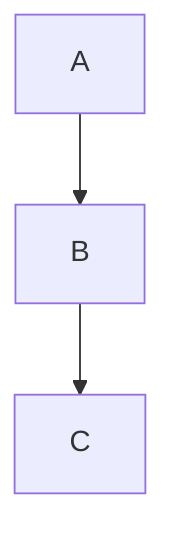

# markdown
## 学习文档
### #号标题

markdown的语言格式其实有点类似python，语法是html，简单但是对格式有要求，比如空格行首之类的，还有代码尖括号也都是识别的，所以写的时候加点空格，但也不要瞎加，即要求文档本身格式可观，下面就不赘述这些了。
p.s. 就算用ob也要严格格式
***
1. ###  换行
直接在一句话后敲两个空格(try了一下，两个空格的前提是你文档里已经换行  类似这种加空格他就不识别 纯文本的话要注意这个点)  
或者< br/>  
标题或者序号之类自动换行
***
2.  ### 字体部分
*这是斜体* _这也是斜体_  
**这是粗体** __这也是粗体__  
***这是粗斜体***  ___这也是粗斜体___  
~~这是要被删除的文字~~  
<u>这行文字已被添加下划线</u>  
Markdown中的语法符号，前面家反斜线\即可以显示符号本身。\.\+\_\*\\

***
3.  ###  引用
>这是一个引用：
>>这是一个引用的引用
>>>这是一个引用的引用的引用
***
4.  ###  链接
[链接名称](链接地址)或者<链接地址>  
示例：[bilibili](https://www.bilibili.com/)或者<https://www.bilibili.com/>
***
5.  ###  图片
  
示例：
***
6.  ###  列表
+ 列表真是意外的好用，如这个标题一样，不同标签可以嵌套使用。不同标签有序无序之间行间距不太一样。由于标题用了序号，然后这个有序会自动排序，所以写在这个无序层级下面。
    * 无序列表 1
    + 无序列表 2
        + 无序列表层级 2.1
            + 前面添加tab键 2.2
    - 无序列表 3

    1. 有序列表 1
    2. 有序列表 2
    3. 有序列表 3  
        3.1 有序列表层级
            3.1 失败层级展示
    4. 有序列表层级需要先有换行再tab，即需要在上一级有两个空格，无序的倒是没这个要求吼
    5.
***
7.  ###  分割线
写分割线---前，要空一行之后写，否则会导致前一行字体放大。其他分隔符似乎没这个问题。
---
***
- - -
* * *
8. ### 代码
一行里代码引用：`Hello` World.
```c
#include<stdio.h>
int main(){
   printf("用```包围代码块");
   //上面还可以标注语言，wc好方便
}
```
    #include<stdio.h>
    int main(){
    printf("用tab包围代码块，这个tab能起作用的针对的是纯文本，so对于列表之类emmm");
    }
***
9. ### 表格
+ 表格使用|来分割不同的单元格，使用-来分隔表头和其他行，总结：纯画
    + :-：将表头及单元格内容左对齐
    + -:：将表头及单元格内容右对齐
    + :-:：将表头及单元格内容居中

| 我是 | 一个 | 表格 |
|:---- |-----:|:----:|
|左| 右 |居中嘿|
***
9. ### 脚注
这是一个例句[^1]。
这是第一次提到这个话题[^note]。
后面再次提到同样的话题[^note]。

[^note]: 这是被多次引用的脚注内容。
[^1]: 这是脚注的内容。  
不同的Markdown解析器可能对脚注的支持有所不同，vs里注意回车哦。

10. ### 关于html
md支持原生html，
<table>
    <tr><th rowspan="2">值班人员</th>
        <th>星期一</th>
        <th>星期二</th>
        <th>星期三</th> </tr>
    <tr><td>李强</td>
        <td>张明</td>
        <td>王平</td></tr></table>
<font face="楷体" color=#000000 size=5>改变文字格式</font>

***
11. ### 关于md
还可以做到流程图序列图待办事项等，还有其他关于md的解析器Typora等等，个人觉得暂时够用，vs里要下个解析器的话可以做到流程图，这个还蛮可以的。  
个人觉得暂时够了，有需要后续更近吧love you


